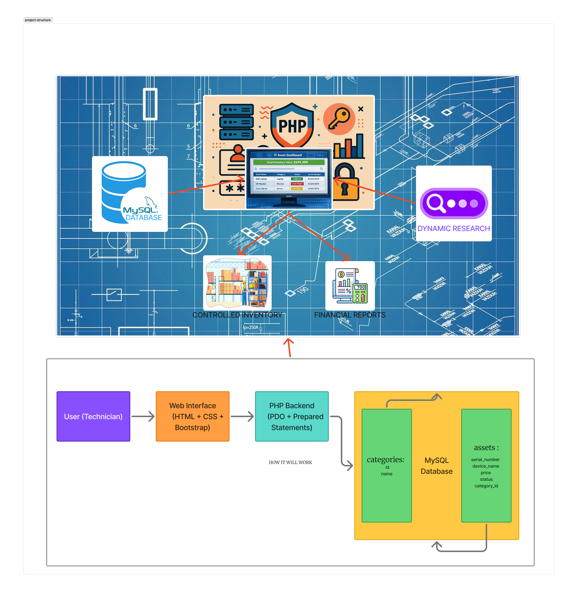

Project Specification: GearLog (IT Asset Tracker)<br>
Launch Date: Wednesday, March 11, 2026 (Afternoon)<br>
Deadline: Wednesday, March 18, 2026 (Morning)<br>
Objective: Develop a web application to track company hardware inventory, assignments, and repair status.<br>

---------------------------------------------------------------------------------------------------------------

---------------------------------------------------------------------------------------------------------------
# Step 0: Understand the Project
    ## Goal:

Understand the project requirements and identify the main features before starting development.

    ## Topics to learn:

* [ ]  Project requirement analysis

* [ ]  UI planning

* [ ]  Feature breakdown

    ## Learning Resources:

* [ ]  [Project Documentation](https://docs.google.com/document/d/1me2bY8Id5YQKZjPOpJWLE_PHmpLzw03KlPiJZ1Vmy4w)

    ## Tasks checklist:

* [ ]  Read the full project specification.

* [ ]  Identify the main features:

    *   Asset inventory tracking

    *   Category system

    *   Dashboard displaying devices

    *   Search functionality

    *   Inventory value calculation

* [ ]  Sketch the UI layout on paper. for example :

```text
+---------------------------------------+
| GearLog Dashboard                     |
| Total Inventory Value: $5400          |
| Search: [________________]            |
+---------------------------------------+
| Serial | Device | Category | Status   |
|---------------------------------------|
| SN123  | Dell   | Laptop   | Repair   |
+---------------------------------------+
```
    ## Expected results:

Clear understanding of the application features and a rough interface design before development begins.

# Step 1: SQL Fundamentals
    ## Goal:

Learn the SQL basics required to create and query the project database.

    ## Topics to learn:
```text
 CREATE DATABASE

 CREATE TABLE

 INSERT INTO

 SELECT

 WHERE

 INNER JOIN

 SUM()

 LIKE operator
```
    ## Learning Resources:

* [ ]  https://www.w3schools.com/sql/

* [ ]  https://sqlbolt.com/

* [ ]  https://www.mysqltutorial.org/

    ## Tasks checklist:

* [ ]  Practice SQL commands

* [ ]  Create simple tables

* [ ]  Insert test data

* [ ]  Run SELECT queries

    ## Expected results:

Ability to create and query a relational database using SQL.

# Step 2: PHP + MySQL Connection (PDO)
    ## Goal:

Connect PHP to a MySQL database using PDO.

    ## Topics to learn:

* [ ]  PDO database connection

* [ ]  try/catch error handling

* [ ]  executing SQL queries in PHP

    ## Learning Resources:

* [ ]  https://phpdelusions.net/pdo

* [ ]  https://www.php.net/manual/en/book.pdo.php

* [ ]  https://www.w3schools.com/php/php_mysql_connect.asp

    ## Tasks checklist:

* [ ]  Create a basic PDO connection script

* [ ]  Test connection to MySQL database

* [ ]  Handle connection errors with try/catch

    ## Expected results:

A working PHP script that successfully connects to MySQL.

# Step 3: Prepared Statements (Security)
    ## Goal:

Learn how to protect database queries against SQL injection.

    ## Topics to learn:

* [ ]  Prepared statements

* [ ]  SQL injection prevention

    ## Learning Resources:

* [ ]  https://phpdelusions.net/pdo/prepared

* [ ]  https://www.php.net/manual/en/pdo.prepared-statements.php

    ## Tasks checklist:

* [ ]  Write prepared SQL queries

* [ ]  Bind parameters to SQL statements

* [ ]  Test secure query execution

    ## Expected results:

Secure SQL queries that prevent injection attacks.

# Step 4: Web Security Basics
    ## Goal:

Understand common web vulnerabilities and how to prevent them.

    ## Topics to learn:

* [ ]  Cross-Site Scripting (XSS)

* [ ]  htmlspecialchars()

    ## Learning Resources:

* [ ]  https://owasp.org/www-community/attacks/xss/

* [ ]  https://www.php.net/manual/en/function.htmlspecialchars.php

    ## Tasks checklist:

* [ ]  Study XSS attack examples

* [ ]  Use htmlspecialchars() when displaying user input

    ## Expected results:

User data displayed safely without exposing the application to XSS attacks.

# Step 5: HTML Forms and Tables
    ## Goal:

Learn how to collect and display data using HTML forms and tables.

    ## Topics to learn:
```text
 form

 input

 select

 table

 form submission (GET / POST)
```
    ## Learning Resources:

* [ ]  https://developer.mozilla.org/en-US/docs/Learn/Forms

* [ ]  https://www.w3schools.com/html/html_forms.asp

    ## Tasks checklist:

* [ ]  Create a basic HTML form

* [ ]  Submit form data using POST

* [ ]  Display data in an HTML table

    ## Expected results:

Ability to create forms and display structured data in tables.

# Step 6: CSS Layout Basics
    ## Goal:

Style the application interface and improve layout structure.

    ## Topics to learn:

* [ ]  Flexbox layout

* [ ]  Basic table styling

* [ ]  Conditional styling

    ## Learning Resources:

* [ ]  https://css-tricks.com/snippets/css/a-guide-to-flexbox/

* [ ]  https://developer.mozilla.org/en-US/docs/Web/CSS/flex

    ## Tasks checklist:

* [ ]  Create a simple layout using Flexbox

* [ ]  Style HTML tables

* [ ]  Apply conditional styles for statuses

    ## Expected results:

A clean and readable user interface.

# Step 7: Project Setup
    ## Goal:

Prepare the local development environment.

    ## Topics to learn:

* [ ]  Local server setup

* [ ]  XAMPP usage

* [ ]  Apache and MySQL services

    ## Learning Resources:

* [ ]  [XAMPP Documentation](https://www.apachefriends.org/docs/)

    ## Tasks checklist:

* [ ]  Install XAMPP

* [ ]  Start Apache and MySQL

* [ ]  Create project folder
```text
htdocs/PROJECT_GEAR_LOG
```
* [ ]  Test project in browser
```text
http://localhost/PROJECT_GEAR_LOG
```
    ## Expected results:

A working local development environment.

# Step 8: Database Design
    ## Goal:

Design the relational database structure for the application.

    ## Topics to learn:

* [ ]  Relational databases

* [ ]  Foreign keys

* [ ]  Database normalization

    ## Learning Resources:

* [ ]  [MySQL documentation](https://www.w3schools.com/sql/)

    ## Tasks checklist:

* [ ]  Create database gearlog

* [ ]  Create categories table

* [ ]  Create assets table

* [ ]  Add foreign key relationship

* [ ]  Insert sample data

    ## Expected results:

A properly structured database ready for the application.

# Step 9: Database Connection
    ## Goal:

Create a reusable database connection file.

    ## Topics to learn:

* [ ]  PHP file inclusion

* [ ]  PDO database connection

    ## Learning Resources:

* [ ]  [PHP documentation](https://www.w3schools.com/php/)

    ## Tasks checklist:

* [ ]  Create db.php

* [ ]  Implement PDO connection

* [ ]  Use try/catch for error handling

    ## Expected results:

All project pages can access the database through a shared connection file.

# Step 10: Add Asset Form
    ## Goal:

Create a form that allows users to add new assets.

    ## Topics to learn:

* [ ]  HTML forms

* [ ]  POST requests

    ## Learning Resources:

* [ ]  [HTML documentation](https://www.w3schools.com/html/)

    ## Tasks checklist:

* [ ]  Create add_asset.php

* [ ]  Form fields:

    *   Serial number

    *   Device name

    *   Price

    *   Category

    *   Status

    ## Expected results:

Users can submit new asset information through the web interface.

# Step 11: Insert Assets into Database
    ## Goal:

Store submitted asset data in the database.

    ## Topics to learn:

* [ ]  CRUD operations

* [ ]  Prepared statements

    ## Learning Resources:

* [ ]  [PDO documentation](https://www.php.net/manual/en/pdo.installation.php)

    ## Tasks checklist:

* [ ]  Receive form data using $_POST

* [ ]  Use prepared statements

* [ ]  Insert asset into database

* [ ]  Redirect back to dashboard

    ## Expected results:

Assets submitted from the form are saved in the database.

# Step 12: Build the Dashboard
    ## Goal:

Display stored assets in a dashboard interface.

    ## Topics to learn:

* [ ]  PHP loops

* [ ]  Dynamic HTML generation

    ## Learning Resources:

* [ ]  [PHP documentation](https://www.w3schools.com/php/)

    ## Tasks checklist:

* [ ]  Create index.php

* [ ]  Fetch assets from database

* [ ]  Display assets in an HTML table

    ## Expected results:

Users can view all assets from the database in the dashboard.

# Step 13: Implement Relational JOIN
    ## Goal:

Display category names instead of category IDs.

    ## Topics to learn:

* [ ]  Relational database queries

* [ ]  JOIN operations

    ## Learning Resources:

* [ ]  [SQL JOIN documentation](https://www.w3schools.com/sql/sql_join.asp)

    ## Tasks checklist:

* [ ]  Write SQL INNER JOIN query

* [ ]  Replace category ID with category name

* [ ]  Display category names in dashboard

    ## Expected results:

Dashboard shows readable category names instead of IDs.

# Step 14: Inventory Value Calculation
    ## Goal:

Calculate the total value of all assets.

    ## Topics to learn:

* [ ]  SQL aggregate functions

    ## Learning Resources:

* [ ]  [SQL documentation](https://www.w3schools.com/sql/)

    ## Tasks checklist:

* [ ]  Use SQL SUM(price)

* [ ]  Display total inventory value on dashboard

    ## Expected results:

Dashboard shows the total inventory value.

# Step 15: Search Functionality
    ## Goal:

Allow users to search assets in the system.

    ## Topics to learn:

* [ ]  Dynamic SQL queries

* [ ]  Filtering results

    ## Learning Resources:

* [ ]  [SQL documentation](https://www.w3schools.com/sql/)

    ## Tasks checklist:

* [ ]  Add search bar

* [ ]  Capture search input

* [ ]  Use SQL LIKE query

* [ ]  Filter assets by name or serial number

    ## Expected results:

Users can search for specific assets.

# Step 16: Conditional Styling
    ## Goal:

Improve UI readability using color-coded statuses.

    ## Topics to learn:

* [ ]  CSS classes

* [ ]  Conditional styling

    ## Learning Resources:

* [ ]  [CSS documentation](https://www.w3schools.com/CSS/)

    ## Tasks checklist:

* [ ]  Apply colors based on asset status:
```text
        Not available → red

        Under Repair → orange

        Deployed → green

        Available → blue
```
    ## Expected results:

Asset status is visually distinguishable.

# Step 17: Security Implementation

    ## Goal:

Ensure the application follows secure coding practices.

    ## Topics to learn:

* [ ]  Security Measures :some basic OWASP security practices:

    *   SQL Injection prevention using PDO prepared statements
    *   Cross-Site Scripting (XSS) prevention using htmlspecialchars()

    ## Learning Resources:

* [ ]  [PDO Prepared statements](https://www.php.net/manual/en/pdo.prepared-statements.php)

* [ ]  [htmlspecialchars](https://www.php.net/manual/en/function.htmlspecialchars.php)

    ## Tasks checklist:

* [ ]  Use prepared statements everywhere

* [ ]  Sanitize outputs using htmlspecialchars()

* [ ]  Avoid direct SQL variable injection

    ## Expected results:

The application is protected from common web vulnerabilities.

# Step 18: Project Organization
    ## Goal:

Organize project files into a clear structure.

    ## Topics to learn:

* [ ]  [Project structuring ](https://academy.recforge.com/#/course/php-language-mastery-480/level-9-building-a-complete-web-application/setting-up-the-project-structure)

* [ ]  [Project structuring for beginners ](https://www.youtube.com/watch?v=CpUov3TSQ9Y)

    ## Tasks checklist:

```text
PROJECT_GEAR_LOG/
├── db.php
├── index.php
├── add_asset.php
├── delete_asset.php
│
├── assets/
│   └── css/
│       └── style.css
│
└── database/
    └── schema.sql
```

    ## Expected results:

Clean and maintainable project structure.

# Step 19: Optional Bonus Features
    ## Goal:

Enhance the project with advanced features.

    ## Topics to learn:

* [ ]  PHP OOP

* [ ]  Bootstrap UI

* [ ]  Authentication systems

    ## Learning Resources:

* [ ]  https://www.php.net/manual/en/language.oop5.basic.php

* [ ]  https://getbootstrap.com/docs/5.3/getting-started/introduction/

* [ ]  https://www.php.net/manual/en/function.password-hash.php

* [ ]  https://www.php.net/manual/en/function.password-verify.php

    ## Tasks checklist:

* [ ]  Implement OOP architecture

* [ ]  Create classes: Database, Asset, Category

* [ ]  Add Bootstrap UI

* [ ]  Implement authentication system

    ## Expected results:

A more professional and scalable application.

-------------------------------------------------------------------

# Final Submission Checklist

* [ ]  Database created

* [ ]  PDO connection works

* [ ]  Assets can be added

* [ ]  Dashboard displays assets

* [ ]  Category names shown via JOIN

* [ ]  Inventory value calculated

* [ ]  Search feature works

* [ ]  Status colors applied

* [ ]  Prepared statements used

* [ ]  Outputs sanitized with htmlspecialchars()